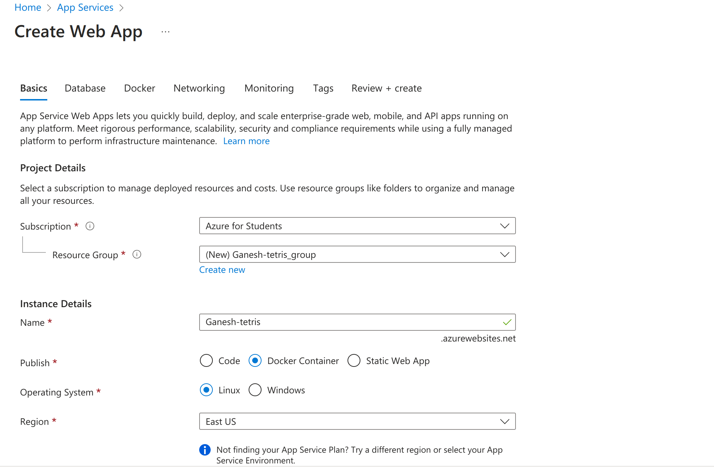
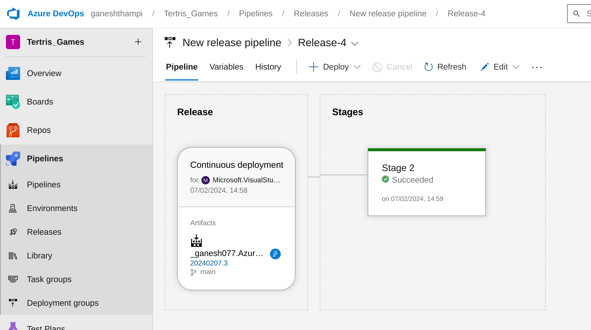

# Azure DevOps Project: Build and Release Pipeline for Azure Container App Deployment

This guide outlines the steps to create Azure DevOps build and release pipelines for deploying Azure Container Apps (Tetris game) to Azure App Service.

# Prerequisites :
- An Azure account with an active subscription.
- An Azure DevOps organization.

## Creating Azure DevOps project with build and release pipelines
- Build pipeline triggers on GitHub repository change, pulls code, and builds Docker container image
- Release pipeline deploys the image to Azure app service and showcases application changes

## Setting Up Azure DevOps Project and Service Connections
- Start by creating a project in Azure DevOps with visibility set to private.
- Proceed to create service connections for Azure Container Registry and GitHub in Project settings.

## Authentication Setup and Service Connections Creation
- Choose "Grant authorization" and configure OAuth for Azure Pipelines.
- Create service connections, grant access permissions, and save the settings.

## Weld and Configure
- Once the job is completed, build and push operations are finished.
- The image is pushed to the container registry, ready to create a Linux web app.

## Creating Release Pipeline on Azure DevOps Portal
- Navigate to the project pipeline and select releases.
- Configure Azure App Service deployment with build artifacts and enable continuous deployment triggers.

## Creating and Deploying a Release Pipeline in Azure DevOps
- Click on 'create release' to deploy the release pipeline.
- Access and update application settings (Enable port 3000) in the Azure portal before browsing the application URL.

## Verifying Build and Release Pipeline Setup
- Access the build pipeline and release pipeline from the GitHub repository on your local system.
- Modify the Tetris application file, push changes to the remote repository, and verify build and release status.

## Azure Release Pipeline
- The release pipeline is automatically triggered on GitHub repository changes.

